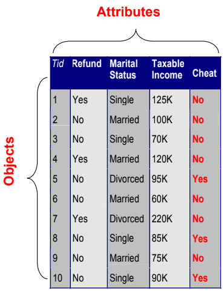
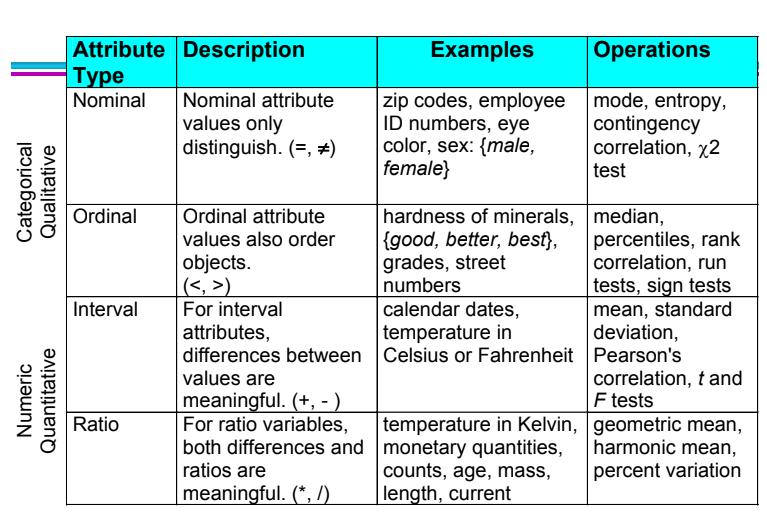
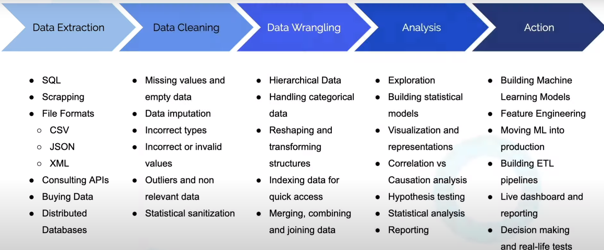

# Introdução

## O que são dados

Dados: coleções de fatos e pedaços individuais de informações
- Dados são gerados a todo momento
    - Compras com cartões
    - Criação de contas em websites
    - Navegação na internet
- Dados são armazenados em computadores (pessoais ou nuvens)

Dados são extremamente importantes para tomadas de decisões, planejamento e até mesmo ao contar uma história
- Contém informações relevantes
- Uma vez analisados, podem trazer vários benefícios

### Estrutura dos dados

Dados
- Coleção de objetos e seus atributos

Atributos
- Propriedade ou característica de um objeto
- Ex: cor de olho, temperatura, estado civil, preço, etc

Valores de atributos
- Números ou símbolos atribuídos a um atributo para um objeto em particular

Objeto
- Coleção de atributos
- Também pode ser conhecido como
    - registro, ponto, instância, entidade, amostra

### Tipos de atributos: Atributos qualitativos (Discreto)

Características
- Expressos em **caracteres não numéricos**
    - imagens
    - vídeos
    - documentos de texto
    - strings
- Não pode ser mensurado ou contado

Nominal
- ID's, cor dos olhos, CEP, etc

Ordinal
- rankings
    - Ex: Em uma escala de 1 a 10, o quanto a pessoa gosta de chocolate
- notas
- altura (alto, médio, curto)

### Tipos de atributos: Atributos quantitativos (Contínuo)

Características
- Expressos em **caracteres numéricos**
- Pode ser mensurado, contado

Interval
- Não existe "true zero"
- Datas de calendário
- Temperaturas em Celsius ou Fahrenheit (oº não significa ausência de calor)

Ratio
- Existe "true zero"
- Comprimento
- Contagens
- Peso (peso = 0 = sem peso = ausência de uma determinada quantidade)

### Tipos de atributos: Imagens

## O que é Análise de dados

Processo de **inspeccionar, limpar, transformar e modelar** dados com o objetivo de descobrir informações úteis para auxiliar na tomada de decisões
- Inspeccionar, limpar e transformar: Coletar, limpar e transformar os dados para análise futura
- Modelar: Adaptar cenários da vida real utilizando estatísticas de inferência para ver se existe algum padrão nos dados

Uma vez que os dados foram processados e modelos foram criados, tentaremos **produzir conclusões** encontrando possíveis padrões ou anomalias
- Transormação de DADOS em INFORMAÇÕES
- Exemplo: Cookies são mais vendidos nas terças-feiras

Por fim, as conclusões devem ser informadas para outros departamentos para que isso possa ser utilizada na tomada de decisões na empresa

"At its core, data analysis is about identifying and predicting trends and figuring out patterns, correlations, and relationships in the available data, and finding solutions to complex problems"
- https://www.freecodecamp.org/news/what-is-data-analysis/

